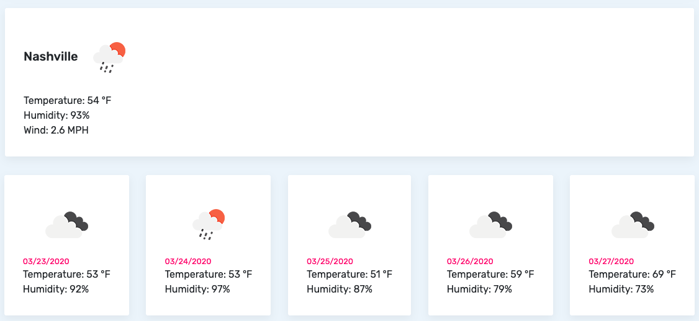

# Weather App

## Live Link
[https://acd37.github.io/weather-app/](https://acd37.github.io/weather-app/)

## Contributors
@acd37

## Technology Stack
* JavaScript, jQuery, AJAX, HTML, Bootstrap, TypedJS

## About
* Completed version of student's homework from the Vanderbilt Coding Bootcamp

## Home Page

## Dashboard Page

## License 
* MIT

## Contact
#### Developer/Full-stack Web Software Developer
* Name: Alec Down (@acd37)
* Homepage: [alecdown.com](https://alecdown.com)
* e-mail: alecdown@gmail.com
* Twitter: @acdown87
* LinkedIn: https://www.linkedin.com/in/alecdown/

